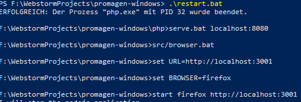
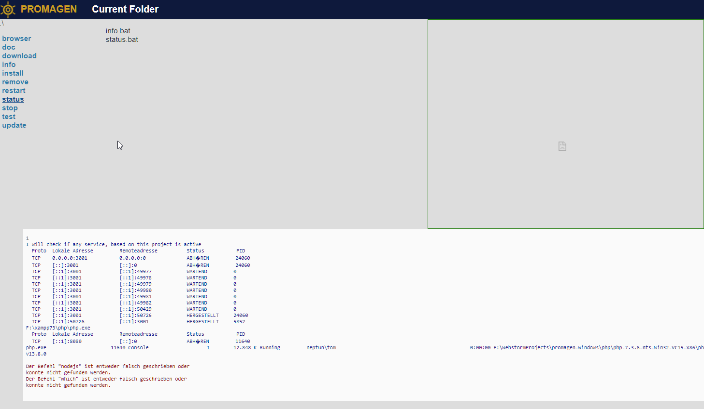
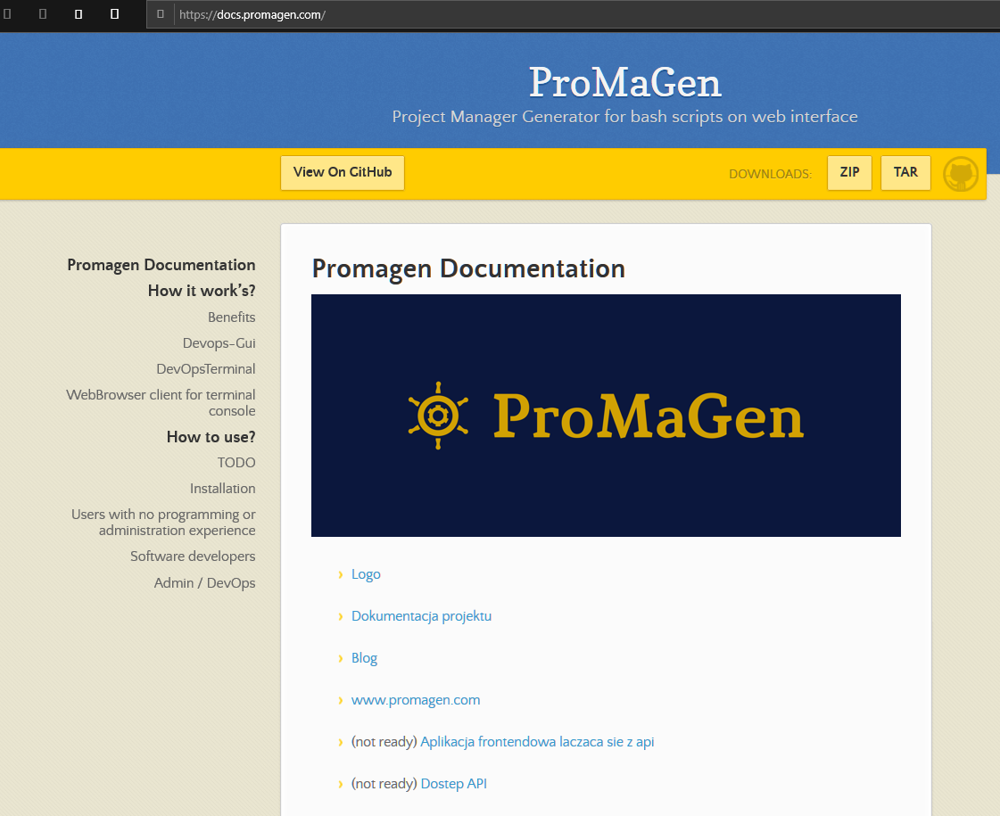
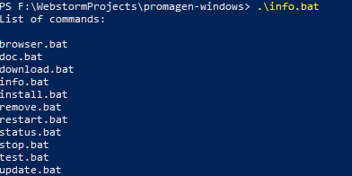
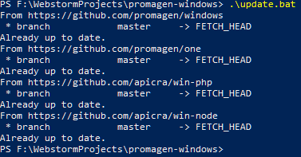

# ProMaGen ONE
scripts for one project in one folder

+ [ECOSYSTEM](ECOSYSTEM.md)
+ [APIEXEC](APIEXEC.md)
+ [WINDOW](WINDOW.md)

https://github.com/promagen/one.git

    git clone https://github.com/promagen/one.git one

Main Website Documentation
https://docs.promagen.com/

Blog: News, Updates
https://blog.promagen.com/

## required

+ git, https://gitforwindows.org/
+ nodejs

## Installation on windows

download using git command

    git clone https://github.com/promagen/windows.git promagen-win
    cd promagen-win

## start working with ProMaGen

    download.bat
    install.bat
    
    restart.bat

### start browser on  http://localhost:3001/
+ [ProMaGen One](http://localhost:3001/)

### start scripts on browser

## check in console

    doc.bat

    info.bat

## update

    update.bat

## Why ProMaGen
+ wspiera budowanie aplikacji i kontrole środowiska od strony tworzenia procesów
    + Dane, baza danych
        + migracja danych
        + aktualizacja
        + restowanie
        + zamian haseł użytkowników
    + Software Development, aplikacja z projektu
        + aktualizacja bibliotek
        + git: github
        + packages: composer, npmjs

    + Marketing, publikowanie informacji o zmianach, aktualizacjach
        + blogi: wordpress
        + social media: twotter
        + ...

W przypaku uzycia wersji standalone

## Versions

    [platform]-[interface]-[language]

+ platform:
    + server
    + client
    + standalone
        + independent, without network connection, offline version

+ os:
    + (all)
    + win
    + linux
    + ios
    + android

+ interface:
    + restapi
    + gui

+ language:
    + nodejs
    + python
    + go

## How to install

### Linux
copy the executable file from /bin folder to another, your project folder and execute

    /bin/app

### Windows
copy the executable file from /bin folder to another, your project folder and execute

    /bin/app.exe

# FOR Developers

Install on linux

    sudo apt install npm

Install on windows

    npm install

Node on linux

    sudo npm install -g npm

Start

    node promagen.js

## Shell execute file
https://ourcodeworld.com/articles/read/154/how-to-execute-an-exe-file-system-application-using-electron-framework

    var child = require('child_process').execFile;
    var executablePath = "C:\\Program Files (x86)\\Google\\Chrome\\Application\\chrome.exe";
    var parameters = ["--incognito"];

    child(executablePath, parameters, function(err, data) {
         console.log(err)
         console.log(data.toString());
    });

## Problem with vcbuild.bat
run in powershell

    npm install --global windows-build-tools

## About processes
https://nodejs.org/api/child_process.html

## ProMaGen

### based on npm versions:

+ desktop: local with nexe and electron window
    + express
    + electron
    + nexe / ...

+ server: only express service, works on external domain
    + express
    + node js service

### based on java versions:
+ desktop:
    + JVM

+ server:
    + .jar service on tomcat

+ mobile: server + optimisation for mobile devices
    + express
    + nexe
    + https://github.com/Urucas/slideout

## Alternatives for electron
https://www.phoronix.com/scan.php?page=news_item&px=HTML5-Golang-Desktop-Apps
The Electron software framework that allows creating desktop GUI application interfaces using JavaScript and relies upon a bundled Chromium+Node.js run-time is notorious among most Linux desktop users for being resource heavy, not integrating well with most desktops, and generally being despised. For those that are fond of using web standards for creating desktop GUIs, now there is a way to create desktop application front-ends using HTML5 and Golang but with less baggage.

## lorca
https://archive.fosdem.org/2019/schedule/event/godesktopapps/attachments/slides/2994/export/events/attachments/godesktopapps/slides/2994/slides.pdf
https://ftp.fau.de/fosdem/2019/UD2.120/godesktopapps.webm

https://github.com/zserge/lorca
https://github.com/zserge/webview

Lorca
+ Chrome DevTools Protocol
+ Bind Go functions to JS
+ Call JS from Go
+ Control native window

## Webview
github.com/zserge/webview
Webview is now being rewritten from scratch, with the support of EdgeHTML

## The Way, Solutions
https://xpda.net/
Cross-Platform Desktop Apps (XPDA)
Write Once Run Anywhere (WORA) development for desktop operating systems.

# Push notification

https://morioh.com/p/ba5c0f01e4ef

Code:
https://github.com/bradtraversy/node_push_notifications

Webpush Repo:
https://github.com/web-push-libs/web-push

# The integration with Apicra
https://github.com/apicra

for example:

    .apicra\-project-create.bat "tom-sapletta-com" "apicra/win-python"

